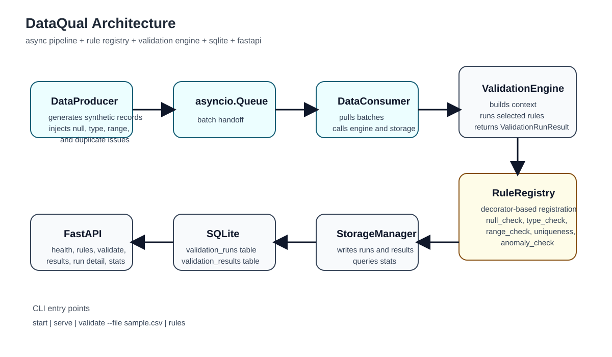

# DataQual

DataQual is a real-time data quality monitoring system built in Python. It simulates a stream of event records, validates those records with a decorator-registered rule system, stores validation history in SQLite, and exposes a FastAPI API for querying current and historical quality results.

The project is designed to satisfy the course goals around packaging, typing, testing, async programming, and non-trivial Python architecture. The core idea is to make the system feel more like a small production service than a one-off script: records are generated continuously, validated in batches, written to persistent storage, and then inspected through both CLI and HTTP interfaces.

## Demo Visual



## Features

- Async producer-consumer pipeline built with `asyncio`
- Decorator-based validation rule registry
- Batch validation engine with per-record and per-rule results
- SQLite persistence through `aiosqlite`
- FastAPI API for health checks, rule listing, validation, results, and stats
- Click-based CLI for running the full system or one-off validation
- Typed codebase with `mypy`
- Automated tests with `pytest`

## Why This Project Is Interesting

This is not just a CSV checker or a basic CRUD API. The project combines:

- synthetic streaming data generation
- async batch processing
- metaprogramming through a global rule registry
- historical storage and querying
- both CLI and web interfaces

That combination gives the project a more systems-oriented feel than a single-script validator.

## Project Structure

```text
dataqual_project/
  dataqual/
    __init__.py
    __main__.py
    api.py
    engine.py
    models.py
    storage.py
    pipeline/
      consumer.py
      producer.py
    rules/
      __init__.py
      builtin.py
      registry.py
  tests/
    test_api.py
    test_engine.py
    test_pipeline.py
    test_rules.py
    test_storage.py
  docs/
    architecture.svg
  pyproject.toml
  README.md
```

## Architecture

At a high level the system works like this:

1. `DataProducer` generates synthetic event records in batches.
2. Those batches are pushed into an `asyncio.Queue`.
3. `DataConsumer` pulls batches from the queue.
4. `ValidationEngine` runs every selected validation rule on each record.
5. `StorageManager` writes run summaries and detailed rule results into SQLite.
6. The FastAPI app exposes HTTP endpoints for querying rules, runs, results, and aggregate statistics.

### Main Modules

#### `dataqual/models.py`

Defines the main data structures used everywhere else:

- `FieldSpec`: one field definition in the schema
- `Schema`: the overall expected shape of input records
- `RuleResult`: result of one rule on one record
- `RecordValidationResult`: all rule results for one record
- `ValidationRunResult`: summary for an entire validation batch
- helper functions such as `default_schema()` and `build_numeric_stats()`

#### `dataqual/rules/registry.py`

Implements the decorator-based metaprogramming component.

- `RuleRegistry.register(...)` creates a decorator that auto-registers a rule
- `RuleRegistry.get_all_rules()` returns the globally registered rules
- `RuleRegistry.get_rule(name)` returns one rule by name

This is the part that satisfies the metaprogramming requirement most directly.

#### `dataqual/rules/builtin.py`

Contains the built-in validation rules:

- `null_check`
- `type_check`
- `range_check`
- `uniqueness_check`
- `anomaly_check`

Each rule is decorated with `@RuleRegistry.register(...)`, so the validation engine does not need to be edited when new rules are added.

#### `dataqual/engine.py`

This is the validation orchestrator.

- chooses which rules to run
- builds per-record validation context
- runs each rule
- assembles `ValidationRunResult`

#### `dataqual/pipeline/producer.py`

Simulates a live data source.

- generates records continuously
- injects occasional data quality problems
- sends batches into the queue

#### `dataqual/pipeline/consumer.py`

Simulates a validation worker.

- reads batches from the queue
- sends them into the validation engine
- persists the result through storage

#### `dataqual/storage.py`

Owns all SQLite interactions.

- creates tables
- saves validation runs
- saves detailed rule results
- queries history
- computes time-window statistics

#### `dataqual/api.py`

Defines the FastAPI application and HTTP endpoints.

#### `dataqual/__main__.py`

Defines the CLI entry points:

- `start`
- `serve`
- `validate`
- `rules`

## Data Model

The SQLite database uses two tables.

### `validation_runs`

Stores one row per validation batch:

- `id`
- `triggered_by`
- `started_at`
- `finished_at`
- `total_records`
- `pass_count`
- `fail_count`

### `validation_results`

Stores one row per rule result:

- `id`
- `run_id`
- `record_index`
- `rule_name`
- `passed`
- `severity`
- `field`
- `message`
- `created_at`

This two-table structure makes it easy to query either batch-level summaries or detailed failures.

## Installation

### Prerequisites

- Python 3.12+
- [`uv`](https://docs.astral.sh/uv/)

### Setup

From the project root:

```bash
cd "/Users/zoeychen/Desktop/Adv python/dataqual_project"
uv sync --extra dev
```

## Running The Project

Because the module form is the most reliable in the current local setup, use:

```bash
uv run python -m dataqual ...
```

### Start full system

Runs both the API server and the async producer-consumer pipeline:

```bash
uv run python -m dataqual start
```

After startup, the service is available at:

```text
http://127.0.0.1:8000
```

### Start API only

Runs only the API server:

```bash
uv run python -m dataqual serve
```

### Validate a CSV file

Runs one-off validation against local CSV input:

```bash
uv run python -m dataqual validate --file sample.csv
```

### List rules in the terminal

```bash
uv run python -m dataqual rules
```

## Example API Usage

Once the server is running:

### Health check

```bash
curl http://127.0.0.1:8000/health
```

Example response:

```json
{"status":"ok","pipeline_running":true}
```

### List rules

```bash
curl http://127.0.0.1:8000/rules
```

### View all results

```bash
curl http://127.0.0.1:8000/results
```

### View only failures

```bash
curl "http://127.0.0.1:8000/results?passed=false"
```

### View stats

```bash
curl "http://127.0.0.1:8000/stats?window=24h"
```

### Trigger manual validation

```bash
curl -X POST http://127.0.0.1:8000/validate \
  -H "Content-Type: application/json" \
  -d '{
    "data": [
      {
        "id": 1,
        "user_id": null,
        "event_type": "purchase",
        "amount": -5,
        "timestamp": "2026-05-12T10:00:00+00:00"
      }
    ]
  }'
```

## Sample CSV For Manual Validation

```csv
id,user_id,event_type,amount,timestamp
1,100,purchase,20.5,2026-05-12T10:00:00+00:00
2,,refund,-5,2026-05-12T10:01:00+00:00
1,300,click,99999,2026-05-12T10:02:00+00:00
bad,400,signup,10,2026-05-12T10:03:00+00:00
```

This sample intentionally triggers:

- null failures
- type failures
- range failures
- duplicate failures

## Testing, Linting, and Typing

Run tests:

```bash
uv run --extra dev pytest -q
```

Run Ruff:

```bash
uv run --extra dev ruff check dataqual tests
```

Run mypy:

```bash
uv run --extra dev mypy dataqual
```

## Code Documentation Notes

The codebase includes lightweight inline comments throughout `dataqual/` to make the main methods easier to read quickly. The comments are intentionally short and focus on:

- what a method does
- what shape its output has
- small example outputs for result-producing methods

This keeps the code explainable without overwhelming the implementation.

## Requirements Mapping

### R1 Complete Python application

- packaged with `pyproject.toml`
- runnable with `uv`
- CLI and API both available

### R2 Well-tested

- unit tests for rules, engine, storage
- async tests for pipeline
- integration tests for API

### R3 Well-typed

- project uses type annotations throughout
- checked with `mypy`

### R4 Documentation

- this README documents setup, architecture, code structure, and usage
- repository includes a visual architecture diagram

### R5 Advanced feature

- async pipeline with `asyncio`
- metaprogramming through decorator-based rule registration

### R6 Code quality

- modular architecture
- linted with Ruff
- tested and typed

### R7 Novelty

- combines streaming simulation, validation rules, persistence, and querying

## Current Limitations

- rule addition still requires writing Python code rather than pure configuration
- the API currently returns JSON directly and does not include a dedicated frontend
- anomaly detection is intentionally simple and uses a z-score heuristic

## Future Improvements

- richer filtering and query options
- more configurable schemas
- plugin-style rule discovery from separate files or packages
- cleaner dashboard-style result presentation
- additional anomaly detection strategies

## Repository

- GitHub: [ZoeyChen-0615/dataqual](https://github.com/ZoeyChen-0615/dataqual)
