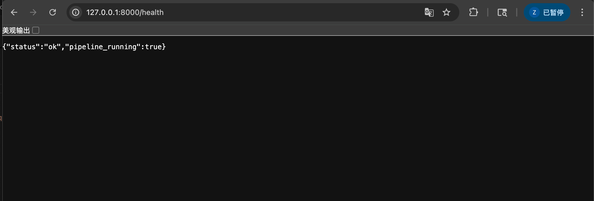
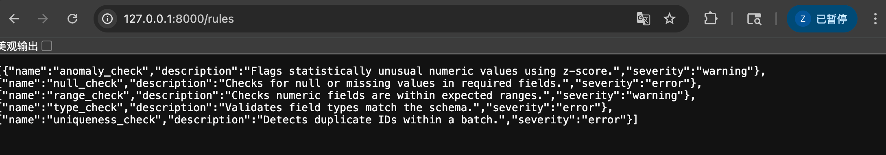
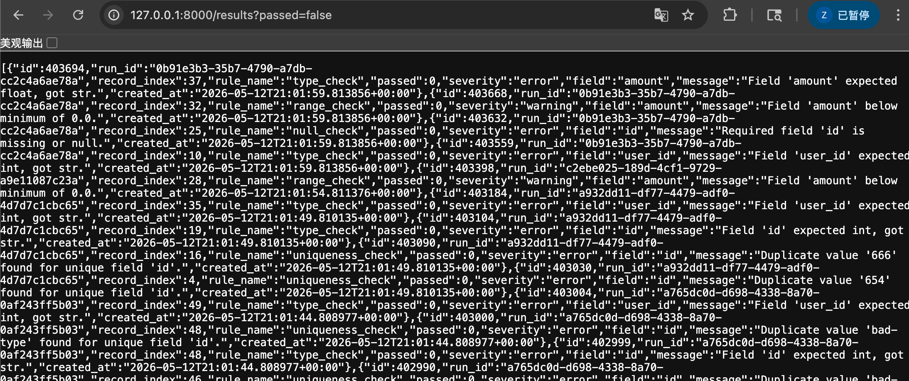
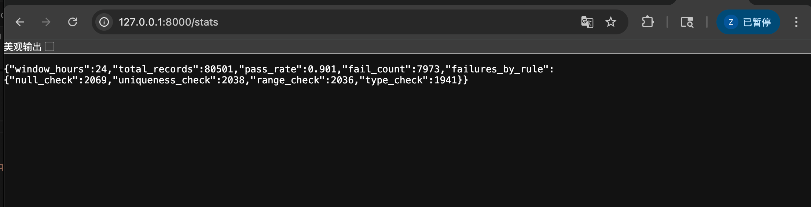
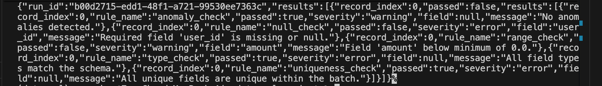

# DataQual

DataQual is a real-time data quality monitoring system in Python. It simulates a stream of event records, validates those records with a rule system, stores validation history in SQLite, and exposes a FastAPI API for querying results and statistics.

The project is built as a small end-to-end system rather than a single script. It has a running pipeline, validation rules, persistent storage, a web API, and CLI commands for starting the system or running manual validation.

## Demo

In a demo, I start the full system with one command. After that:

- the producer keeps generating fake event data
- the consumer validates each batch
- the validation results are written into SQLite
- I can open API endpoints like `/health`, `/rules`, `/results`, and `/stats`
- I can also run a manual validation on a CSV file and compare that result with the automatically generated data

So the demo shows both continuous validation and one-off validation.

## Features

- async producer-consumer pipeline built with `asyncio`
- decorator-based validation rule registry
- batch validation engine
- SQLite persistence through `aiosqlite`
- FastAPI API for health checks, rules, results, and stats
- CLI commands for running the system or validating a file

## Project Structure

```text
dataqual_project/
  dataqual/
    __init__.py
    __main__.py
    api.py
    engine.py
    models.py
    storage.py
    pipeline/
      consumer.py
      producer.py
    rules/
      __init__.py
      builtin.py
      registry.py
  tests/
    test_api.py
    test_engine.py
    test_pipeline.py
    test_rules.py
    test_storage.py
  pyproject.toml
  README.md
```

## Architecture

At a high level the system works like this:

1. `DataProducer` generates synthetic event records in batches
2. those batches are pushed into an `asyncio.Queue`
3. `DataConsumer` pulls batches from the queue
4. `ValidationEngine` runs validation rules on each record
5. `StorageManager` writes run summaries and rule results into SQLite
6. the FastAPI app exposes endpoints for querying rules, results, and stats

## File Overview

### `dataqual/models.py`

Defines the main data structures used across the project.

- schema definitions
- rule result objects
- record-level result objects
- run-level result objects
- helper functions for default schema and numeric statistics

### `dataqual/rules/registry.py`

Handles rule registration.

- stores all registered rules
- provides the decorator used to register a new rule
- lets the engine fetch rules by name or list all rules

### `dataqual/rules/builtin.py`

Contains the built-in validation rules.

Current rules include:

- null check
- type check
- range check
- uniqueness check
- anomaly check using z-score

### `dataqual/engine.py`

Runs the validation process.

Important jobs:

- choose which rules to run
- validate a whole batch
- validate one record
- assemble the final validation result

### `dataqual/pipeline/producer.py`

Simulates incoming data.

Important jobs:

- generate fake records
- inject occasional bad data
- push batches into the queue

### `dataqual/pipeline/consumer.py`

Processes incoming batches.

Important jobs:

- read from the queue
- send data to the validation engine
- save results to storage

### `dataqual/storage.py`

Owns all database work.

Important jobs:

- create tables
- save validation runs
- save detailed rule results
- query historical results
- compute aggregate stats

### `dataqual/api.py`

Defines the FastAPI app and the HTTP endpoints.

### `dataqual/__main__.py`

Defines the CLI commands:

- `start`
- `serve`
- `validate`
- `rules`

## Data Model

The SQLite database uses two tables.

### `validation_runs`

Stores one row per validation batch:

- `id`
- `triggered_by`
- `started_at`
- `finished_at`
- `total_records`
- `pass_count`
- `fail_count`

### `validation_results`

Stores one row per rule result:

- `id`
- `run_id`
- `record_index`
- `rule_name`
- `passed`
- `severity`
- `field`
- `message`
- `created_at`

## Setup

From the project root:

```bash
uv sync --extra dev
```

## Running The Project

### Start full system

Runs both the API server and the async producer-consumer pipeline:

```bash
uv run python -m dataqual start
```

After startup, the service is available at:

```text
http://127.0.0.1:8000
```

### Start API only

Runs only the API server:

```bash
uv run python -m dataqual serve
```

### Validate a CSV file

Runs one-off validation against local CSV input:

```bash
uv run python -m dataqual validate --file sample.csv
```

If you only want to test different values, edit `sample.csv`. If you want a different field structure, also update the project schema in `dataqual/models.py` and any related validation rules.

### List rules in the terminal

```bash
uv run python -m dataqual rules
```

## Example API Usage

Once the server is running:

### Health check

```bash
curl http://127.0.0.1:8000/health
```

Example response:

```json
{"status":"ok","pipeline_running":true}
```

### List rules

```bash
curl http://127.0.0.1:8000/rules
```

### View all results

This returns historical results stored in the database, including older generated data if the same `dataqual.db` file is reused.

```bash
curl http://127.0.0.1:8000/results
```

### View only failures

Use `passed=false` if you only want failed rule results instead of the full history.

```bash
curl "http://127.0.0.1:8000/results?passed=false"
```

### View stats

```bash
curl "http://127.0.0.1:8000/stats?window=24h"
```

### Trigger manual validation

```bash
curl -X POST http://127.0.0.1:8000/validate \
  -H "Content-Type: application/json" \
  -d '{
    "data": [
      {
        "id": 1,
        "user_id": null,
        "event_type": "purchase",
        "amount": -5,
        "timestamp": "2026-05-12T10:00:00+00:00"
      }
    ]
  }'
```

## Testing

Run tests:

```bash
uv run --extra dev pytest -q
```

Run Ruff:

```bash
uv run --extra dev ruff check dataqual tests
```

## Code Review

### Who reviewed my code / when

- Reviewer: Jason Diaz Aguas <jdaguas@uchicago.edu>
- Date: 2026/05/18

### Commit and files reviewed

- Commit reviewed: `b9b0585325d10e83ea5187e7c0d9bd23e9d3a1d2`
- Files discussed:
  - `dataqual/pipeline/producer.py`
  - `dataqual/pipeline/consumer.py`
  - `dataqual/engine.py`
  - `dataqual/rules/registry.py`
  - `dataqual/storage.py`
  - `dataqual/api.py`

### Questions I asked the reviewer to focus on

1. Does the overall architecture make sense, especially the way the pipeline, validation engine, rule registry, and storage layer fit together?
2. Do the async pipeline and rule registration system feel like solid implementations, or are there places where the design could be simpler or clearer?
3. Is the storage/API flow easy to follow, and are there any improvements that would make the system easier to use?

### Reviewer responses

1. The project architecture makes sense to me and presumably to other users. The core architecture is solid and has a good layered design.

2. One possible improvement would be to add slightly more lifecycle handling around the pipeline. In its current iteration,  the consumer waits on queue.get(), so if stop() is called while the queue is empty, the loop may still be blocked unless the task is cancelled. The CLI does cancel the tasks during shutdown whic works but using a sentinel value like None or adding timeout-based polling could make shutdown behavior clearer.

3. For the async producer-consumer pipeline, I would suggest is setting a maxsize on the queue. Currently, the queue is created with no limit, so if the producer becomes much faster than the consumer or storage slows down, batches could build up indefinitely. Another possible improvement is to track pipeline metrics, such as queue size, batches produced, batches consumed, and batches failed. Since the project already has a /health endpoint, it could eventually include something like queue depth or processed batch count.

4. For the validation engine, I especially like the use of ValidationContext. That gives rules access to batch-level information such as seen unique values and numeric statistics  which don't make each rule recompute those things independently. 
One design question: validate_record is async, but the individual rule functions are synchronous. It's perfectly fine, but since the engine awaits validate_record, it might be worth deciding whether future rules are expected to be async. If not, the async layer could be simplified. If yes, the registry type could eventually support async rule functions too.

5. One final improvement would be returning more summary information from /validate.  The pass/fail counts aren't called unless the caller separately looks up the run. Since the engine already calculates total_records, pass_count, and fail_count, returning those fields would make the manual validation endpoint more useful.


### Discussion notes

- I learned that the overall architecture was understandable to another developer, especially the separation between the pipeline, validation engine, rule registry, storage, and API.
- I also learned that even when the core design is solid, small interface changes can still improve usability. The reviewer’s point about returning summary fields from `/validate` was especially useful because it made the manual validation flow clearer and easier to test.

### What changes this review led to

- I updated the `/validate` endpoint in `dataqual/api.py` so it now returns `total_records`, `pass_count`, and `fail_count` together with `run_id` and `results`.
- I also updated `tests/test_api.py` to check those new response fields.


### Why the other review suggestions did not lead to changes

- I did not change the shutdown logic because this pipeline is currently coordinated through task cancellation. Adding a sentinel-based shutdown path would introduce a second shutdown mechanism, which does not fit the current control flow as cleanly.
- I did not add a queue `maxsize` because the current pipeline is designed as a simple always-running stream. A bounded queue would require an explicit backpressure policy between producer speed, consumer speed, and storage writes, and that behavior is not defined in the current design.

